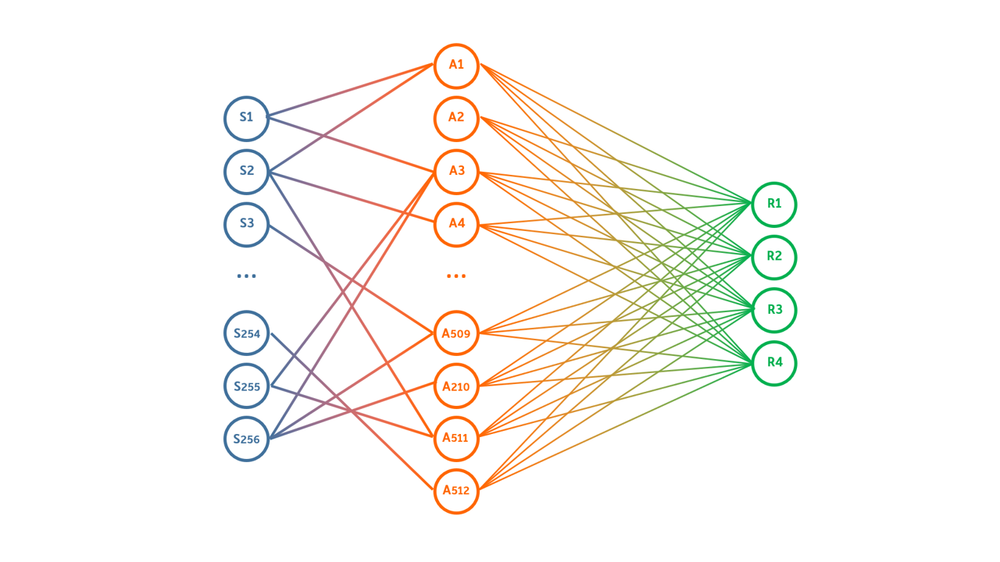

# Написание свёрточной нейронной сети для распознавания дорожных знаков, аугментация данных, обучение сети / Convolutional neural network creation for traffic sign recognition, data augmentation, neural network training

*Разработчик/Developer*

1. [Андрей Недов](https://github.com/Andrey-Nedov-is-a-human)

# Задача

*Разработать алгоритм классификации стандартизованных изображений с помощью свёрточной нейронной сети.*

- Подготовить приложение для генерации обучающей выборки из исходного набора изображений;
- Разработать функцию расчета свёрточной карты для выбранного ядра;
- Разработать класс, реализующий функциональность свёрточной сети для
- классификации изображений;
- Разработать функцию обучения с учителем для нейтронной сети по подготовленной ранее обучающей выборке.

_Изображения для распознавания:_

[Полный текст задания/Full issue text](https://github.com/Andrey-Nedov-is-a-human/Convolutional-Neural-Network-Hand-Made/tree/main/materials/Task_NN_2019_L3_CNN.pdf)

# Данные

Датасет был получен из исходных шаблонов путём аугментации данных с добавления шума, сдвигов, изменения яркости и угла поворота изображения.

В качестве свёрточных ядер опытным путём были подобраны следующие 4:

# Архитектура сети

Сеть получает на вход биноризованное по цвету изображение размером 64х64 пикселя, и сжимае его до 20х20. Далее следует операция свёртки. Дополнительная граница изображению не дорисовывается, поэтому после свёртки
