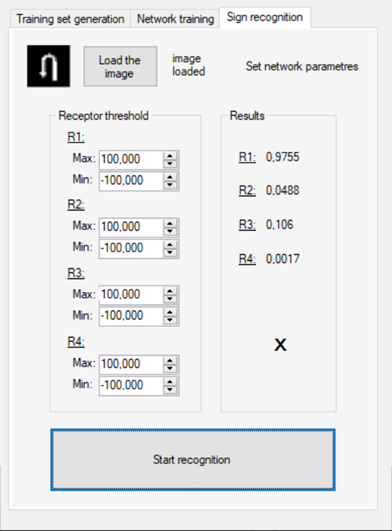
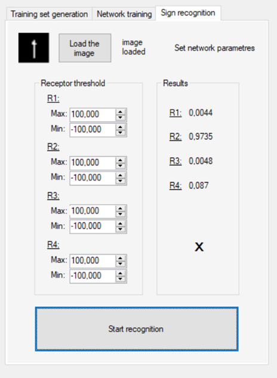
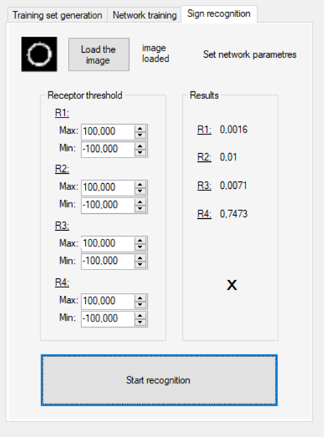

# Написание свёрточной нейронной сети для распознавания дорожных знаков, аугментация данных, обучение сети / Convolutional neural network creation for traffic sign recognition, data augmentation, neural network training

*Разработчик/Developer*

1. [Андрей Недов](https://github.com/Andrey-Nedov-is-a-human)

# Задача

*Разработать алгоритм классификации стандартизованных изображений с помощью свёрточной нейронной сети.*

- Подготовить приложение для генерации обучающей выборки из исходного набора изображений;
- Разработать функцию расчета свёрточной карты для выбранного ядра;
- Разработать класс, реализующий функциональность свёрточной сети для классификации изображений;
- Разработать функцию обучения с учителем для нейтронной сети по подготовленной ранее обучающей выборке.

__Задание выполняетя на языке С# с использованием только стандартных библиотек.__

_Изображения для распознавания:_

[Полный текст задания/Full issue text](https://github.com/Andrey-Nedov-is-a-human/Convolutional-Neural-Network-Hand-Made/tree/main/materials/Task_NN_2019_L3_CNN.pdf)

# Данные

Датасет был получен из исходных шаблонов путём аугментации данных с добавления шума, сдвигов, изменения яркости и угла поворота изображения.

В качестве свёрточных ядер опытным путём были подобраны следующие четрые ядра с разрешением 5x5 пикселей:

# Архитектура сети

Сеть получает на вход биноризованное по цвету изображение размером 64х64 пикселя, и сжимае его до 20х20. Далее следует операция свёртки. Дополнительная граница изображению не дорисовывается, поэтому после свёртки результатом является двумерный вектор размером 16x16. Далее вектор подаётся на сенсорный слой нейронной сети, откуда, проходя через скрытый слой, попадает на четыре результирующих нейрона, по одному на каждый шаблон.

# Обучение сети

## Алгоритм обучения сети
100 раз:

Берём по небольшому набору (например 20) изображений каждого знака из соответствующей директории (по разу из каждой директории получается 4 набора) когда изображения в директории заканчиваются алгоритм обнуляет счётчик изображений для каждой директории и берёт изображения с первого.

Методом обратного распростронения ошибки обучаем сеть на полученной выборке.

## Метод обратного распространения ошибки

0. Инициализация весов небольшими случайными значениями
1. Выполнять шаги 2 – 9 до достижения требуемой точности
2. Для каждой пары {входной вектор, целевое значение} выполнять шаги 3 – 8
3. Входные нейроны (Si, i = 1,2...n) формируют сигналы Si для скрытого слоя
4. Нейроны скрытого слоя (Hj, j = 1,2...p) суммируют сигналы Hin = V0j + Σ(Si\*Vij) и применяет функцию активации  Hj = f(Hin_j), где V - веса между слоями
5. Нейроны выходного слоя (Rk, k = 1,2...m) суммируют сигналы Rin = W0k + Σ(Hk\*Wjk) и применяет функцию активации  Rk = f(Rin_k), где W - веса между слоями
6. Каждый выходной нейрон (Rk, k = 1,2...m) вычисляет ошибку сопоставляя результат с целевым значением σk = (Tk - Rk)\*f'(Rin_k). 
Затем вычисляет изменение веса связи ΔWjk = a\*σk\*Hj и величину корректировки смещения W0k = a\*σk, где a - коэффицент обучения (Learning rate)
7. Каждый скрытый нейрон (Hj, j = 1,2...p) суммирует ошибки σin_j = Σ(σk\*Wjk) и вычисляет величину ошибки, умножая значение на величину производной активационной функции
σj = σin_j\*f'(Rin_k), затем вычисляет изменение веса связи ΔVij = a\*σj\*Si и величину корректировки смещения V0j = a\*σj
8. Каждый выходной нейрон (Rk, k = 1,2...m) изменяет веса своих связей со скрытым слоем Wjk = Wjk_new = Wjk_old + ΔWjk. Каждый скрытый нейрон (Hj, j = 1,2...p) изменяет веса своих связей Vij = Vij_new = Vij_old + ΔVij
9. Проверка условия прекращения работы алгоритма:
- количество итераций
- минимальная суммарная квадратичная ошибка
- скорость изменения ошибки
- (дополнительно) устойчивость снижения ошибки (контроль сходимости решения)

## Время обучения
Примерно 3 минуты  

# Результат работы обученной сети

[Отчёт с кодом проекта/Report with a code](https://github.com/Andrey-Nedov-is-a-human/Convolutional-Neural-Network-Hand-Made/tree/main/materials/Report.pdf)

  
  
  
  

 
