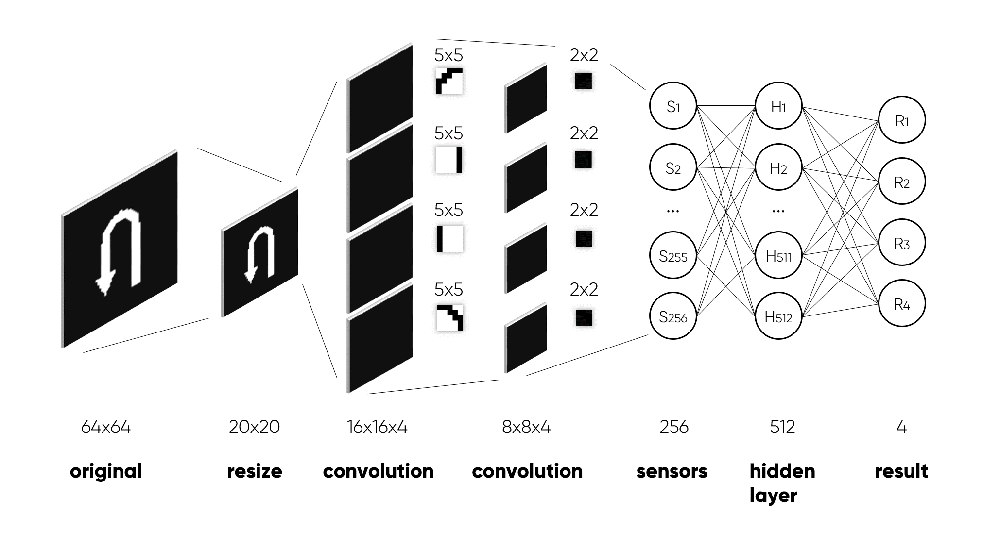

# Convolutional neural network for traffic sign recognition, data augmentation, neural network training

*05.04.2020*

*Developer*

1. [Andrey Nedov](https://github.com/Andrey-Nedov)

# Objective of the project

*Develop an algorithm for classifying standardized images using a convolutional neural network.*

- Prepare an application for generating a training dataset from an initial set of images;
- Develop a function for calculating a convolution map for the selected kernel;
- Develop a class that implements the functionality of a convolutional network for image classification;
- Develop a supervised learning function for a neural network using a previously prepared training set.

__The task is performed in C# using only standard libraries.__ 

_Images for recognition:_

[Full issue text](https://github.com/Andrey-Nedov-is-a-human/Convolutional-Neural-Network-Hand-Made/tree/main/materials/Task_NN_2019_L3_CNN.pdf)

# Dataset

A separate application was written to generate a dataset from the original templates by augmenting the data by adding noise, shifts, changing the brightness and angle of rotation of the image.

As convolutional kernels, the following four kernels with a resolution of 5x5 pixels were empirically selected:

# Network architecture

<!-- Сеть получает на вход четыре бинаризованных по цвету шаблона одиного знака, каждый размером 64х64 пикселя, и сжимает его до 20х20. Далее следует операция свёртки каждого шаблона с одним из ядер. Дополнительная граница изображению не дорисовывается, поэтому результатом свёртки является вектор размером 16x16х4. Потом ядром 2х2 происходит сжитие каждого свёрнутого шаблона до размера 8х8, и в итоге вектор 8х8х4 подаётся на сенсорный слой нейронной сети, откуда, проходя через скрытый слой, попадает на четыре результирующих нейрона, по одному на каждый шаблон. -->

The network receives four color-binarized patterns of the same character as input, each 64x64 pixels in size, and compresses it to 20x20. This is followed by the operation of convolution of each template with one of the cores. The additional border is not drawn to the image, so the result of the convolution is a 16x16x4 vector. Then the 2x2 kernel compresses each folded template to a size of 8x8, and as a result, the 8x8x4 vector is fed to the sensor layer of the neural network, from where, passing through the hidden layer, it gets to four resulting neurons, one for each template.

# Network training

## Network learning algorithm
100 times:

<!-- Берём по небольшому набору (например 20) изображений каждого знака из соответствующей директории (по разу из каждой директории получается 4 набора) когда изображения в директории заканчиваются алгоритм обнуляет счётчик изображений для каждой директории и берёт изображения с первого. -->

We take a small set (for example, 20) of images of each character from the corresponding directory (once from each directory, 4 sets are obtained) when the images in the directory run out, the algorithm resets the image counter for each directory and takes images from the first one.

We train the network on the received sample by the backpropagation error method.

## Backpropagation method

0. Initializing weights with small random values
1. Follow steps 2 - 9 until the required accuracy is achieved
2. For each pair {input vector, target value} perform steps 3 - 8
3. Input neurons (Si, i = 1,2...n) form signals Si for the hidden layer
4. Hidden layer neurons (Hj, j = 1,2...p) sum the signals Hin = V0j + Σ(Si\*Vij) and applies the activation function  Hj = f(Hin_j), where V - weight between layers
5. Output layer neurons (Rk, k = 1,2...m) sum the signals Rin = W0k + Σ(Hk\*Wjk) and applies the activation function  Rk = f(Rin_k), where W - weight between layers
6. Each output neuron (Rk, k = 1,2...m) calculates an error by comparing the result with the target value σk = (Tk - Rk)\*f'(Rin_k). 
Then it calculates the change in the link weight ΔWjk = a\*σk\*Hj and offset adjustment amount W0k = a\*σk, where a - learning rate
7. Each hidden neuron (Hj, j = 1,2...p) summarizes errors σin_j = Σ(σk\*Wjk) and calculates the error value by multiplying the value by the value of the derivative of the activation function
σj = σin_j\*f'(Rin_k), then calculates the change in the link weight ΔVij = a\*σj\*Si and offset adjustment amount V0j = a\*σj
8. Each output neuron (Rk, k = 1,2...m) changes the weights of its links to the hidden layer Wjk = Wjk_new = Wjk_old + ΔWjk. Each hidden neuron (Hj, j = 1,2...p) changes the weights of its connections Vij = Vij_new = Vij_old + ΔVij
9. Checking the termination condition of the algorithm:
- number of iterations
- minimum total squared error
- error change rate
- (optional) stability of error reduction (convergence control of the solution)

## Studying time
Approximately 3 minutes  

# The result of the trained network

[Report with a code](https://github.com/Andrey-Nedov/Convolutional-Neural-Network-Hand-Made/tree/main/materials/Report.pdf)

  
  
  
  

 
